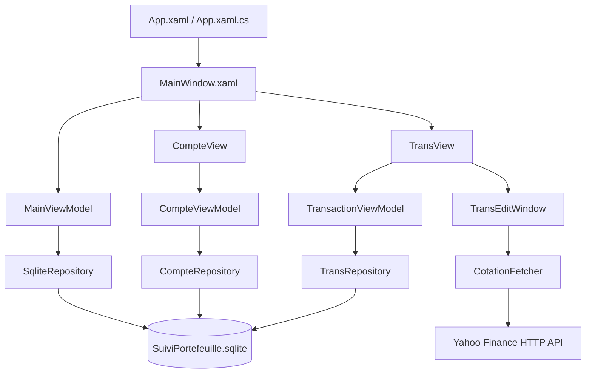
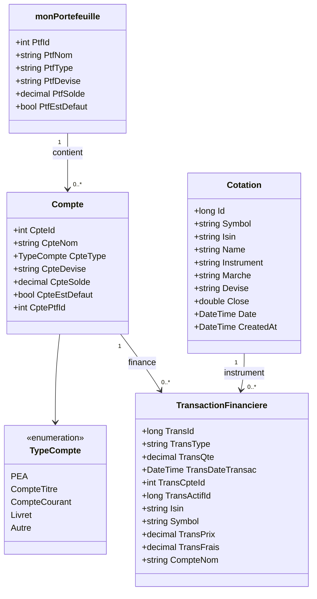
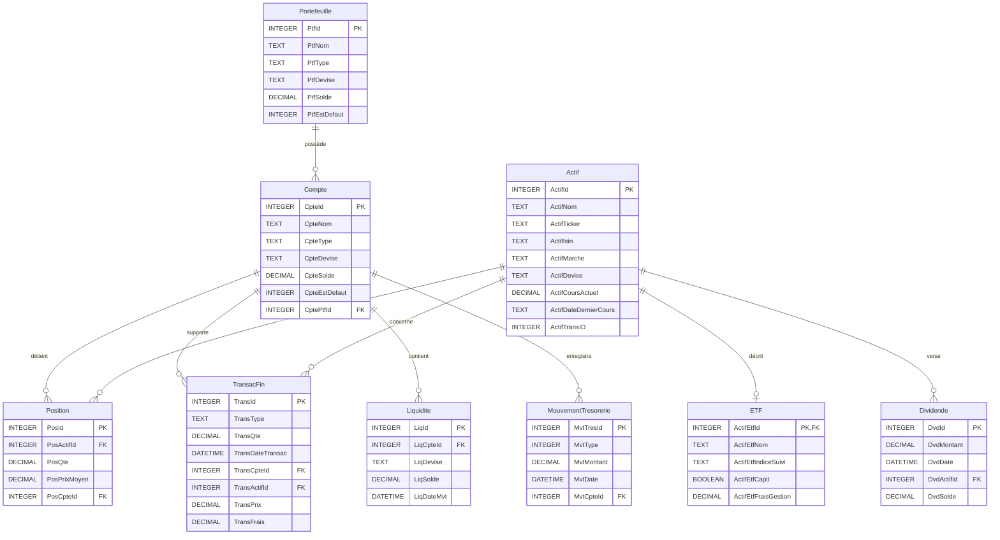
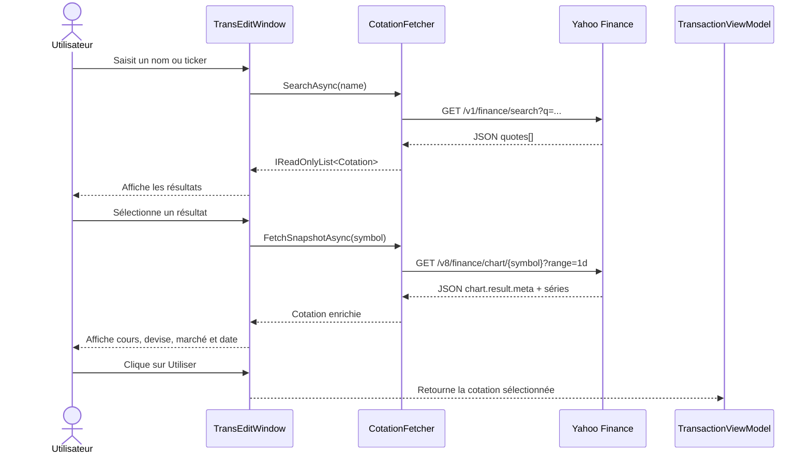
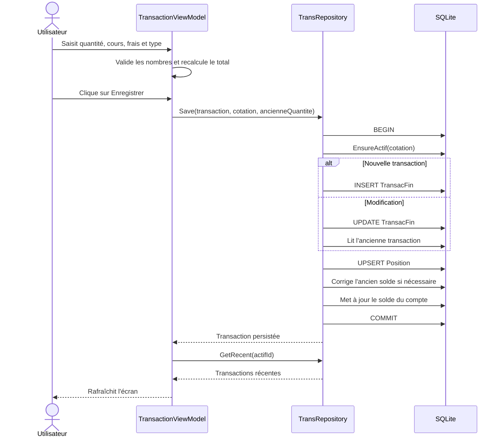
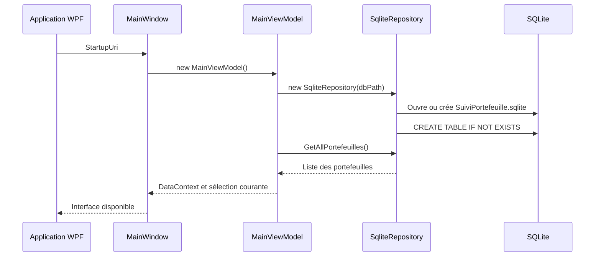

# Re-engineering du projet SuiviPortefolio

## 1. Objet du document

Ce document présente une rétro-conception du projet **SuiviPortefolio** à partir
du code source existant. Il décrit :

- l'architecture technique et l'organisation des dossiers ;
- les responsabilités des principaux composants ;
- le schéma relationnel SQLite observé dans `Data/Database.cs` ;
- les flux fonctionnels de recherche de cotation et d'enregistrement d'une
  transaction ;
- les diagrammes UML sous forme de blocs Mermaid.

Les diagrammes sont volontairement centrés sur les composants réellement
présents dans le projet. Les éléments non implémentés ou seulement préparés
dans le schéma de base sont signalés comme tels.

## 2. Vue d'ensemble

SuiviPortefolio est une application de bureau Windows basée sur :

- **.NET 10** et **WPF** ;
- un modèle de présentation proche de **MVVM** ;
- **SQLite** via `Microsoft.Data.Sqlite` ;
- **Yahoo Finance** comme source distante de recherche et de cours ;
- une base locale `SuiviPortefeuille.sqlite`, créée dans le répertoire de
  sortie de l'application.

Le point d'entrée WPF est [`App.xaml`](./App.xaml). La fenêtre principale est
[`Portefeuille/PortefeuilleView/MainWindow.xaml`](./Portefeuille/PortefeuilleView/MainWindow.xaml),
qui expose trois zones fonctionnelles :

1. Portefeuilles ;
2. Comptes ;
3. Transactions.

## 3. Architecture logique



### 3.1 Couches identifiées

| Couche | Responsabilité | Composants principaux |
|---|---|---|
| Présentation WPF | Fenêtres, contrôles, événements utilisateur et thèmes | `MainWindow`, `CompteView`, `TransView`, `TransEditWindow` |
| Présentation / état | Sélection, commandes, validation simple, rafraîchissement des collections | `MainViewModel`, `CompteViewModel`, `TransactionViewModel` |
| Domaine | Objets métier manipulés par l'interface et la persistance | `monPortefeuille`, `Compte`, `Cotation`, `TransactionFinanciere` |
| Persistance | Création du schéma, requêtes SQLite, transactions SQL | `SqliteRepository`, `CompteRepository`, `TransRepository` |
| Intégration externe | Recherche de valeurs et récupération du dernier cours | `CotationFetcher`, Yahoo Finance |
| Infrastructure | Thèmes, sauvegarde et restauration du fichier SQLite | `ThemeManager`, `DatabaseManager` |

Le découpage est fonctionnel plutôt que strictement hexagonal : certaines vues
créent directement leur ViewModel, et les repositories construisent eux-mêmes
leur chaîne de connexion.

## 4. Structure du projet

```text
SuiviPortefolio/
├── App.xaml(.cs)                         Point d'entrée et ressources WPF
├── SuiviPortefolio.csproj                Projet .NET 10 WPF
├── REVERSE_ENGINEERING.md                Ce document
├── Data/
│   ├── Database.cs                       Schéma SQLite et repository portefeuille
│   ├── DBManager.cs                      Sauvegarde/restauration SQLite
│   └── RechercheCotations.cs             Client Yahoo Finance
├── Portefeuille/
│   ├── PortefeuilleModel/Portefeuille.cs Modèle monPortefeuille
│   ├── PortefeuilleView/                  MainWindow et fenêtre d'édition
│   └── PortefeuilleViewModel/             MainViewModel
├── Comptes/
│   ├── CompteModel/Compte.cs              Compte et TypeCompte
│   ├── CompteRepository/                  ICompteRepository / CompteRepository
│   ├── CompteView/                        Contrôles et fenêtres WPF
│   └── CompteViewModel/                   CompteViewModel
├── Transactions/
│   ├── TransModel/                        Cotation / TransactionFinanciere
│   ├── TransRepository/                   ITransRepository / TransRepository
│   ├── TransView/                         TransView / TransEditWindow
│   └── TransViewModel/                    TransactionViewModel
├── Ressources/                            Thèmes et styles WPF
└── Tests/
    ├── PortefolioServicesTests/           Tests d'intégration portefeuille
    ├── PortefolioTests/                   Tests UI
    └── TransactionsTests/                 Tests de solde de compte
```

Les répertoires `bin/`, `obj/` et `.vs/` sont des artefacts de compilation ou
d'environnement et ne font pas partie de l'architecture fonctionnelle.

## 5. Modèle objet principal



`Cotation` est le modèle applicatif de l'actif financier. En base, il est
persisté dans la table `Actif`; `TransactionFinanciere` conserve les références
vers `Compte` et `Actif`.

## 6. Schéma de données SQLite

Le schéma ci-dessous est extrait de `Data/Database.cs`. Les tables `ETF`,
`Liquidite`, `MouvementTresorerie` et `Dividende` sont préparées par la base,
mais leur utilisation n'est pas exposée par les écrans actuellement présents.



### Contraintes et règles observées

- Les clés primaires sont généralement auto-incrémentées.
- Les clés étrangères sont activées par `PRAGMA foreign_keys = ON` dans
  `SqliteRepository`.
- Une position est unique pour le couple `(PosCpteId, PosActifId)`.
- Une transaction est un achat ou une vente selon `TransType`.
- La création ou la mise à jour d'une transaction recalcule la position et le
  solde du compte dans une même transaction SQLite.
- Le compte ou portefeuille par défaut est géré par une remise à zéro globale
  puis une affectation ciblée.

## 7. Flux de recherche et sélection d'une cotation



`CotationFetcher` :

- refuse une recherche vide ;
- encode le texte et le symbole dans l'URL ;
- configure un `HttpClient` statique avec décompression et délai de 30 secondes ;
- extrait le dernier `close` exploitable ;
- utilise `regularMarketPrice` et `regularMarketTime` comme repli ;
- transforme les réponses inattendues en `InvalidOperationException`.

Les erreurs réseau et de format sont affichées par `TransEditWindow` à
l'utilisateur via des boîtes de dialogue.

## 8. Flux d'enregistrement d'une transaction



La variation de solde observée est :

- achat : `-(quantité × prix) - frais` ;
- vente : `+(quantité × prix) - frais`.

La position utilise une quantité signée : positive pour un achat, négative
pour une vente. Lorsqu'une transaction est modifiée, l'ancienne variation est
retirée avant d'appliquer la nouvelle.

## 9. Cycle de démarrage et persistance



Le chemin de base est construit avec
`AppDomain.CurrentDomain.BaseDirectory`, ce qui rend la base locale au dossier
de sortie de l'application.

## 10. Responsabilités par composant

### `Data`

- [`Data/Database.cs`](./Data/Database.cs) : initialise le schéma et réalise
  les opérations de portefeuille.
- [`Data/DBManager.cs`](./Data/DBManager.cs) : copie/restaure le fichier SQLite
  et affiche les erreurs à l'utilisateur.
- [`Data/RechercheCotations.cs`](./Data/RechercheCotations.cs) : adapte l'API
  Yahoo Finance vers le modèle `Cotation`.

### Portefeuille

- `MainViewModel` charge la collection, expose les commandes CRUD et gère le
  portefeuille sélectionné.
- `MainWindow` héberge les onglets et les menus de sauvegarde/restauration.

### Comptes

- `CompteViewModel` charge les comptes, sélectionne le compte par défaut et
  délègue les opérations à `ICompteRepository`.
- `CompteRepository` encapsule les requêtes SQL de la table `Compte`.

### Transactions

- `TransactionViewModel` gère les sélections, la validation des champs, le
  calcul du total et le rafraîchissement des transactions récentes.
- `TransEditWindow` réalise la recherche et la prévisualisation d'une cotation.
- `TransRepository` assure la cohérence entre `Actif`, `TransacFin`, `Position`
  et `Compte`.

## 11. Points d'attention pour une re-engineering future

1. **Injection de dépendances** : injecter les repositories et le client Yahoo
   au lieu de les construire dans les ViewModels ou les fenêtres.
2. **Contrats typés** : remplacer les valeurs textuelles `"Achat"` et `"Vente"`
   par un enum partagé.
3. **Séparation des responsabilités** : déplacer les boîtes de dialogue et
   validations d'interface vers des services testables.
4. **Modèle d'actif** : unifier explicitement `Cotation` et la table `Actif`
   afin d'éviter les conversions implicites.
5. **Dates et fuseaux** : conserver les dates en UTC ou documenter clairement
   la conversion opérée depuis les timestamps Yahoo.
6. **Migrations SQLite** : formaliser les évolutions de schéma plutôt que de
   limiter les changements à `AddColumnIfMissing`.
7. **Cohérence du portefeuille courant** : propager explicitement l'identifiant
   du portefeuille sélectionné lors de la création d'un compte, au lieu de
   dépendre d'une valeur par défaut.
8. **Tests** : ajouter des tests ciblés pour les erreurs Yahoo, les ventes
   invalides, les positions négatives et la modification d'une transaction.

## 12. Références du code analysé

- [`README.md`](./README.md)
- [`SuiviPortefolio.csproj`](./SuiviPortefolio.csproj)
- [`Data/RechercheCotations.cs`](./Data/RechercheCotations.cs)
- [`Data/Database.cs`](./Data/Database.cs)
- [`Transactions/TransRepository/TransRepository.cs`](./Transactions/TransRepository/TransRepository.cs)
- [`Transactions/TransViewModel/TransViewModel.cs`](./Transactions/TransViewModel/TransViewModel.cs)
- [`Comptes/CompteRepository/CompteRepository.cs`](./Comptes/CompteRepository/CompteRepository.cs)
- [`Portefeuille/PortefeuilleViewModel/MainViewModel.cs`](./Portefeuille/PortefeuilleViewModel/MainViewModel.cs)

