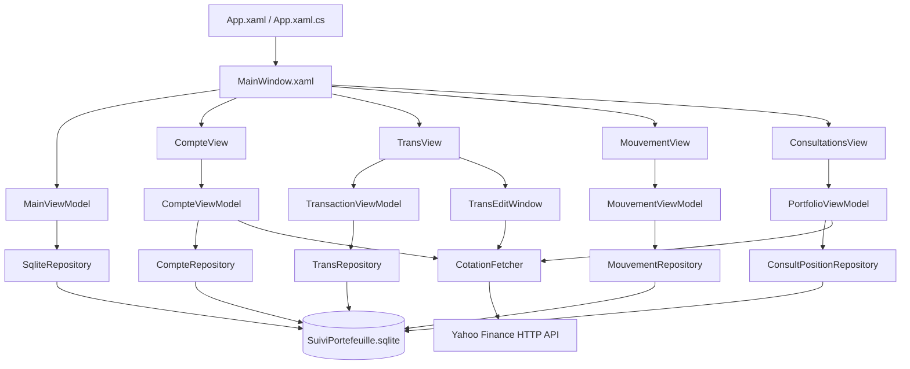
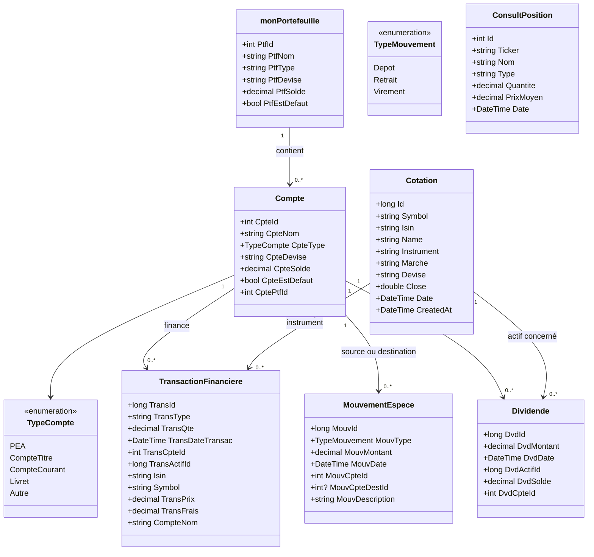
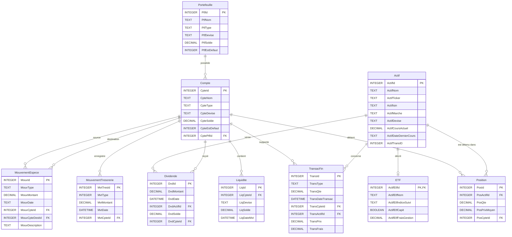
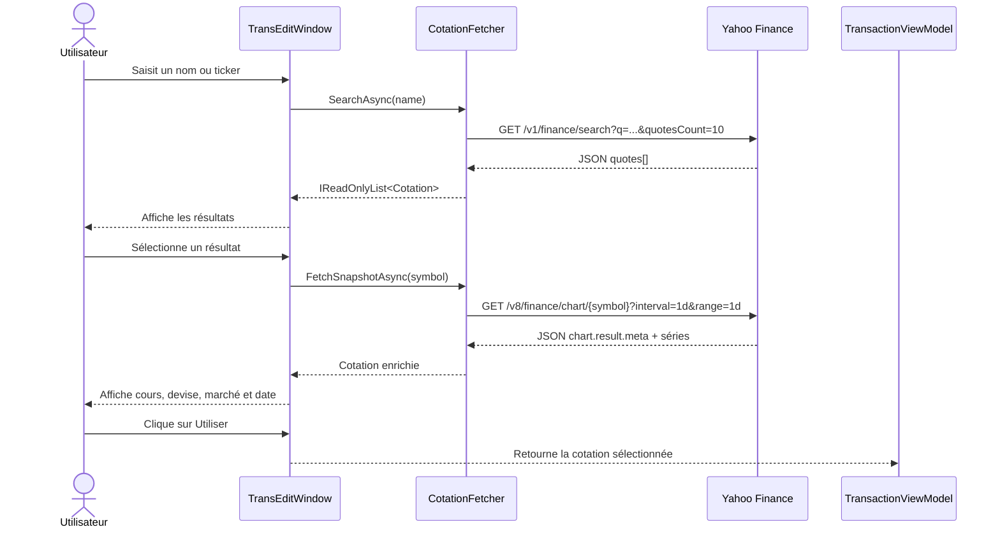
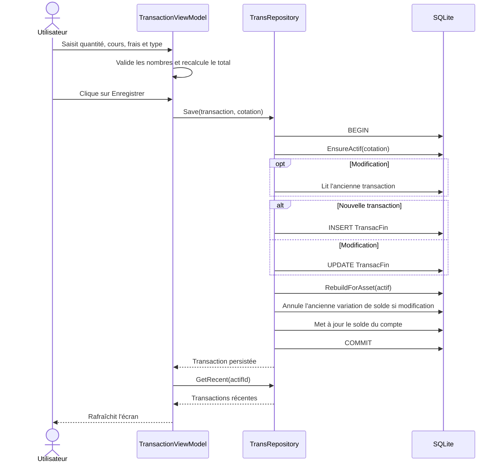
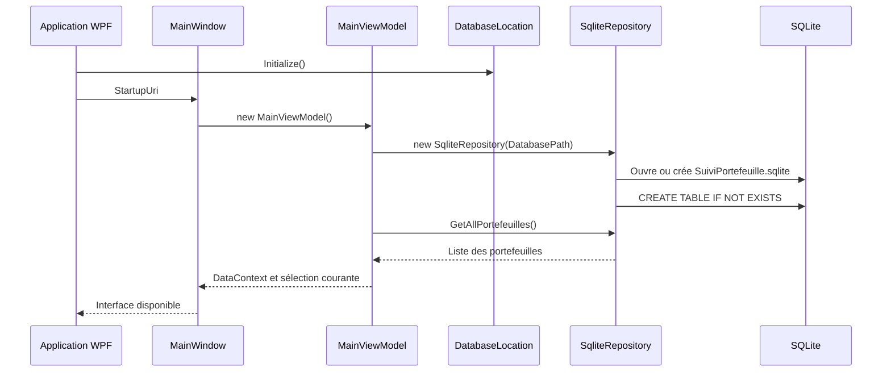

# Re-engineering du projet SuiviPortefolio

## 1. Objet du document

Ce document présente une rétro-conception du projet **SuiviPortefolio** à partir
du code source existant. Il décrit :

- l'architecture technique et l'organisation des dossiers ;
- les responsabilités des principaux composants ;
- le schéma relationnel SQLite observé dans `Data/Database.cs` ;
- les flux fonctionnels de recherche de cotation, de transaction, de mouvement
  d'espèces et de consultation/valorisation ;
- l'emplacement de la base locale et les opérations de sauvegarde/restauration ;
- les diagrammes UML sous forme de blocs Mermaid.

Les diagrammes sont volontairement centrés sur les composants réellement
présents dans le projet. Les éléments non implémentés ou seulement préparés
dans le schéma de base sont signalés comme tels.

## 2. Vue d'ensemble

SuiviPortefolio est une application de bureau Windows basée sur :

- **.NET 10** et **WPF** ;
- un modèle de présentation proche de **MVVM** ;
- **SQLite** via `Microsoft.Data.Sqlite` ;
- **Yahoo Finance** comme source distante de recherche, de cours, d'historique
  et de taux de change ;
- une base locale `SuiviPortefeuille.sqlite`, normalement stockée dans
  `%LOCALAPPDATA%\SuiviPortefolio`.

Le point d'entrée WPF est [`App.xaml`](./App.xaml). La fenêtre principale est
[`Portefeuille/PortefeuilleView/MainWindow.xaml`](./Portefeuille/PortefeuilleView/MainWindow.xaml),
qui expose cinq onglets fonctionnels :

1. Portefeuilles ;
2. Comptes ;
3. Transactions ;
4. Mouvements espèces ;
5. Consultations.

Le dossier de la base peut être modifié depuis le menu **Fichier**. Son chemin
est mémorisé dans `database-directory.txt`, sous `%LOCALAPPDATA%\SuiviPortefolio`.
Au premier démarrage, une ancienne base située à côté de l'exécutable est
importée si aucune base n'existe dans l'emplacement par défaut.

## 3. Architecture logique



### 3.1 Couches identifiées

| Couche | Responsabilité | Composants principaux |
|---|---|---|
| Présentation WPF | Fenêtres, contrôles, événements utilisateur et thèmes | `MainWindow`, `CompteView`, `TransView`, `MouvementView`, `ConsultationsView` |
| Présentation / état | Sélection, commandes, validation, rafraîchissement et valorisation | `MainViewModel`, `CompteViewModel`, `TransactionViewModel`, `MouvementViewModel`, `PortfolioViewModel` |
| Domaine | Objets métier manipulés par l'interface et la persistance | `monPortefeuille`, `Compte`, `Cotation`, `TransactionFinanciere`, `MouvementEspece`, `ConsultPosition` |
| Persistance | Création du schéma, requêtes SQLite, transactions SQL et reconstruction des positions | `SqliteRepository`, `CompteRepository`, `TransRepository`, `MouvementRepository`, `ConsultPositionRepository`, `PositionRebuilder` |
| Intégration externe | Recherche, cours, historique et taux de change | `CotationFetcher`, Yahoo Finance |
| Infrastructure | Emplacement, sauvegarde/restauration SQLite et thèmes | `DatabaseLocation`, `DatabaseManager`, `ThemeManager` |

Le découpage est fonctionnel plutôt que strictement hexagonal : les vues
créent leurs ViewModels, qui instancient généralement leurs repositories. Les
ViewModels de transaction et de mouvement acceptent toutefois des repositories
via leurs interfaces pour faciliter leur substitution.

## 4. Structure du projet

```text
SuiviPortefolio/
├── App.xaml(.cs)                         Point d'entrée et ressources WPF
├── SuiviPortefolio.csproj                Projet .NET 10 WPF
├── REVERSE_ENGINEERING.md                Ce document
├── Data/
│   ├── Database.cs                       Schéma SQLite et repository portefeuille
│   ├── DatabaseLocation.cs                Emplacement configurable de la base
│   ├── DBManager.cs                      Sauvegarde/restauration SQLite
│   ├── ConsultPositionRepository.cs      Lecture des positions
│   ├── PositionRebuilder.cs              Recalcul des positions depuis les transactions
│   └── RechercheCotations.cs             Client Yahoo Finance
├── Portefeuille/
│   ├── PortefeuilleModel/Portefeuille.cs Modèle monPortefeuille
│   ├── PortefeuilleView/                  MainWindow et fenêtre d'édition
│   └── PortefeuilleViewModel/             MainViewModel
├── Comptes/
│   ├── CompteModel/Compte.cs              Compte et TypeCompte
│   ├── CompteRepository/                  ICompteRepository / CompteRepository
│   ├── CompteView/                        Contrôles et fenêtres WPF
│   └── CompteViewModel/                   CompteViewModel (namespace CpteViewModel)
├── Transactions/
│   ├── TransModel/                        Cotation / TransactionFinanciere
│   ├── TransRepository/                   ITransRepository / TransRepository
│   ├── TransView/                         TransView / TransEditWindow
│   ├── TransViewModel/                    TransactionViewModel
│   ├── MouvementModel/                    MouvementEspece / TypeMouvement
│   ├── MouvementRepository/               IMouvementRepository / MouvementRepository
│   ├── MouvementView/                     Écran des mouvements d'espèces
│   └── MouvementViewModel/                MouvementViewModel
├── Consultations/
│   ├── ConsultationsModel/                ConsultPosition
│   ├── ConsultationsView/                 ConsultationsView / AnalysisWindow
│   └── ConsultationsViewModel/            Vue et analyse des positions
├── Ressources/                            Thèmes et styles WPF
└── Tests/
    ├── ComptesTests/                      Tests de valorisation des comptes
    ├── PortefolioServicesTests/           Tests d'intégration portefeuille
    ├── PortefolioTests/                   Tests UI
    └── TransactionsTests/                 Tests de solde de compte
```

Les répertoires `bin/`, `obj/` et `.vs/` sont des artefacts de compilation ou
d'environnement et ne font pas partie de l'architecture fonctionnelle.

## 5. Modèle objet principal



`Cotation` est le modèle applicatif de l'actif financier. En base, il est
persisté dans la table `Actif`; `TransactionFinanciere` conserve les références
vers `Compte` et `Actif`.

## 6. Schéma de données SQLite

Le schéma initial est créé par `Data/Database.cs`. La table
`MouvementEspece`, utilisée par l'écran dédié, est créée séparément par
`MouvementRepository`. `ETF`, `Liquidite` et `MouvementTresorerie` existent
dans le schéma initial, mais ne sont pas exploitées par les écrans actuels.
`Dividende` est utilisé par l'écran Transactions.



### Contraintes et règles observées

- Les clés primaires sont généralement auto-incrémentées.
- `PRAGMA foreign_keys = ON` est activé par `TransRepository` et
  `MouvementRepository` sur leurs connexions; `SqliteRepository` l'exécute lors
  de l'initialisation du schéma. Ce réglage étant propre à chaque connexion,
  il n'est pas activé explicitement par tous les repositories.
- Une position est unique pour le couple `(PosCpteId, PosActifId)`.
- Les transactions financières sont des achats ou ventes; le type dividende
  est enregistré dans la table dédiée `Dividende`, pas dans `TransacFin`.
- La sauvegarde d'une transaction recalcule les positions de l'actif et met à
  jour le solde du compte dans une même transaction SQLite.
- La consultation reconstruit les positions depuis `TransacFin` avant de les
  afficher. La quantité nette et le prix moyen sont donc dérivés des achats et
  ventes, plutôt que considérés comme la source de vérité.
- Un dépôt augmente le solde, un retrait le diminue et un virement débite le
  compte source et crédite le compte destination.
- Un dividende positif est associé à un actif, une date et un compte; il crédite
  ce compte sans modifier la position.
- Le compte ou portefeuille par défaut est géré par une remise à zéro globale
  puis une affectation ciblée.
- Le solde affiché d'un portefeuille est calculé par agrégation des soldes de
  ses comptes; il n'est pas maintenu comme un solde consolidé indépendant.

## 7. Flux de recherche et sélection d'une cotation



`CotationFetcher` :

- refuse une recherche vide ;
- encode le texte, le symbole, la période et l'intervalle dans l'URL ;
- configure un `HttpClient` statique avec décompression et délai de 30 secondes ;
- extrait le dernier `close` exploitable et utilise les métadonnées du marché
  comme solution de repli ;
- expose également la récupération d'historique pour les graphiques de
  consultation ;
- transforme les réponses inattendues en `InvalidOperationException`.

Les erreurs réseau et de format sont affichées par `TransEditWindow` à
l'utilisateur via des boîtes de dialogue.

L'onglet **Consultations** charge les positions persistées, actualise leurs
cours via Yahoo Finance et récupère des séries historiques pour les périodes
proposées dans l'écran. Il permet de sélectionner plusieurs positions et
d'ouvrir une analyse synthétique. Dans l'onglet **Comptes**, la valorisation
combine le solde en espèces et la valeur des positions; les positions libellées
dans une autre devise que le compte sont converties avec des taux Yahoo Finance.

## 8. Flux d'enregistrement d'une transaction



La variation de solde observée est :

- achat : `-(quantité × prix) - frais` ;
- vente : `+(quantité × prix) - frais`.

La position est reconstruite depuis toutes les transactions de l'actif, par
compte et dans l'ordre chronologique. Un achat augmente la quantité et met à
jour le prix moyen pondéré; une vente la diminue. Lorsqu'une transaction est
modifiée, le repository annule l'ancienne variation de solde avant d'appliquer
la nouvelle.

Un dividende suit une autre voie : le montant saisi est un montant total net
positif. `SaveDividend` enregistre l'actif, le compte, la date et le solde après
crédit dans `Dividende`, puis crédite le compte dans la même transaction SQLite.
Il ne modifie pas la position.

### Mouvements d'espèces

L'écran dédié prend en charge les dépôts, retraits et virements. Le
`MouvementRepository` crée la table `MouvementEspece` si nécessaire et applique
les écritures sur les comptes dans une transaction SQLite. Pour un virement,
le compte source est débité et le compte destinataire crédité; la modification
ou la suppression d'un mouvement annule également son impact antérieur sur les
soldes.

## 9. Cycle de démarrage et persistance



`App` initialise `DatabaseLocation` avant l'ouverture de la fenêtre principale.
Par défaut, la base se trouve dans `%LOCALAPPDATA%\SuiviPortefolio`; un ancien
fichier présent à côté de l'exécutable est copié à cet emplacement lors de la
première initialisation. Le choix d'un autre dossier, depuis le menu **Fichier**,
copie la base active et persiste le nouveau chemin dans
`database-directory.txt`. La sauvegarde et la restauration s'appuient sur le
chemin résolu par `DatabaseLocation`.

## 10. Responsabilités par composant

### `Data`

- [`Data/Database.cs`](./Data/Database.cs) : initialise le schéma et réalise
  les opérations de portefeuille.
- [`Data/DatabaseLocation.cs`](./Data/DatabaseLocation.cs) : résout et change
  l'emplacement de la base de données.
- [`Data/DBManager.cs`](./Data/DBManager.cs) : copie/restaure le fichier SQLite
  et affiche les erreurs à l'utilisateur.
- [`Data/PositionRebuilder.cs`](./Data/PositionRebuilder.cs) et
  [`Data/ConsultPositionRepository.cs`](./Data/ConsultPositionRepository.cs) :
  reconstruisent et exposent les positions utilisées dans les consultations.
- [`Data/RechercheCotations.cs`](./Data/RechercheCotations.cs) : adapte l'API
  de recherche, les snapshots et les historiques Yahoo Finance vers les modèles
  de cotation et de prix historiques.

### Portefeuille

- `MainViewModel` charge la collection, expose les commandes CRUD et gère le
  portefeuille sélectionné.
- `MainWindow` héberge les cinq onglets, recharge certains écrans à leur
  sélection et gère les thèmes ainsi que le dossier, la sauvegarde et la
  restauration de la base.

### Comptes

- `CompteViewModel` charge les comptes, sélectionne le compte par défaut et
  calcule la valorisation des positions, avec conversion de devises si
  nécessaire.
- `CompteRepository` encapsule les requêtes SQL des comptes et calcule
  l'exposition des positions par compte et devise.

### Transactions

- `TransactionViewModel` gère les sélections, la validation des champs, le
  calcul du total et le rafraîchissement des transactions récentes.
- `TransEditWindow` réalise la recherche et la prévisualisation d'une cotation.
- `TransRepository` assure la cohérence entre `Actif`, `TransacFin`, `Position`
  et `Compte`; il enregistre également les dividendes dans `Dividende`.

### Mouvements espèces et consultations

- `MouvementViewModel` gère le compte source, le compte destinataire, le type,
  le montant et la liste des mouvements; `MouvementRepository` applique ou
  annule leur effet sur les soldes.
- `PortfolioViewModel` charge les positions, actualise les cours et historiques,
  construit les séries de graphique et présente une analyse des positions
  sélectionnées.

## 11. Points d'attention pour une re-engineering future

1. **Injection de dépendances** : généraliser l'injection des repositories et
   du client Yahoo; plusieurs vues et ViewModels les construisent encore
   directement.
2. **Contrats typés** : remplacer les valeurs textuelles `"Achat"` et `"Vente"`
   par un enum partagé.
3. **Séparation des responsabilités** : déplacer les boîtes de dialogue et
   validations d'interface vers des services testables.
4. **Modèle d'actif** : unifier explicitement `Cotation` et la table `Actif`
   afin d'éviter les conversions implicites.
5. **Dates et fuseaux** : conserver les dates en UTC ou documenter clairement
   la conversion opérée depuis les timestamps Yahoo.
6. **Migrations SQLite** : formaliser les évolutions du schéma; les tables sont
   créées avec `CREATE TABLE IF NOT EXISTS`, sans mécanisme de version de
   migration.
7. **Cohérence du portefeuille courant** : propager explicitement l'identifiant
   du portefeuille sélectionné lors de la création d'un compte, au lieu de
   dépendre d'une valeur par défaut.
8. **Tests** : compléter les tests autour des erreurs Yahoo, dividendes,
   mouvements d'espèces, positions négatives et modifications de transactions.

## 12. Références du code analysé

- [`README.md`](./README.md)
- [`SuiviPortefolio.csproj`](./SuiviPortefolio.csproj)
- [`Data/RechercheCotations.cs`](./Data/RechercheCotations.cs)
- [`Data/Database.cs`](./Data/Database.cs)
- [`Data/DatabaseLocation.cs`](./Data/DatabaseLocation.cs)
- [`Data/ConsultPositionRepository.cs`](./Data/ConsultPositionRepository.cs)
- [`Data/PositionRebuilder.cs`](./Data/PositionRebuilder.cs)
- [`Transactions/TransRepository/TransRepository.cs`](./Transactions/TransRepository/TransRepository.cs)
- [`Transactions/TransViewModel/TransViewModel.cs`](./Transactions/TransViewModel/TransViewModel.cs)
- [`Transactions/MouvementRepository/MouvementRepository.cs`](./Transactions/MouvementRepository/MouvementRepository.cs)
- [`Transactions/MouvementViewModel/MouvementViewModel.cs`](./Transactions/MouvementViewModel/MouvementViewModel.cs)
- [`Comptes/CompteRepository/CompteRepository.cs`](./Comptes/CompteRepository/CompteRepository.cs)
- [`Comptes/CompteViewModel/CompteViewModel.cs`](./Comptes/CompteViewModel/CompteViewModel.cs)
- [`Consultations/ConsultationsViewModel/ConsultPfViewmodel.cs`](./Consultations/ConsultationsViewModel/ConsultPfViewmodel.cs)
- [`Portefeuille/PortefeuilleViewModel/MainViewModel.cs`](./Portefeuille/PortefeuilleViewModel/MainViewModel.cs)
